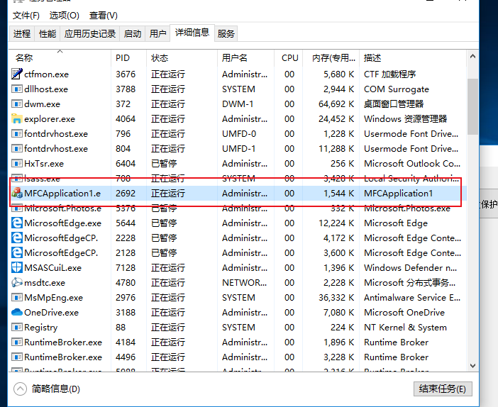
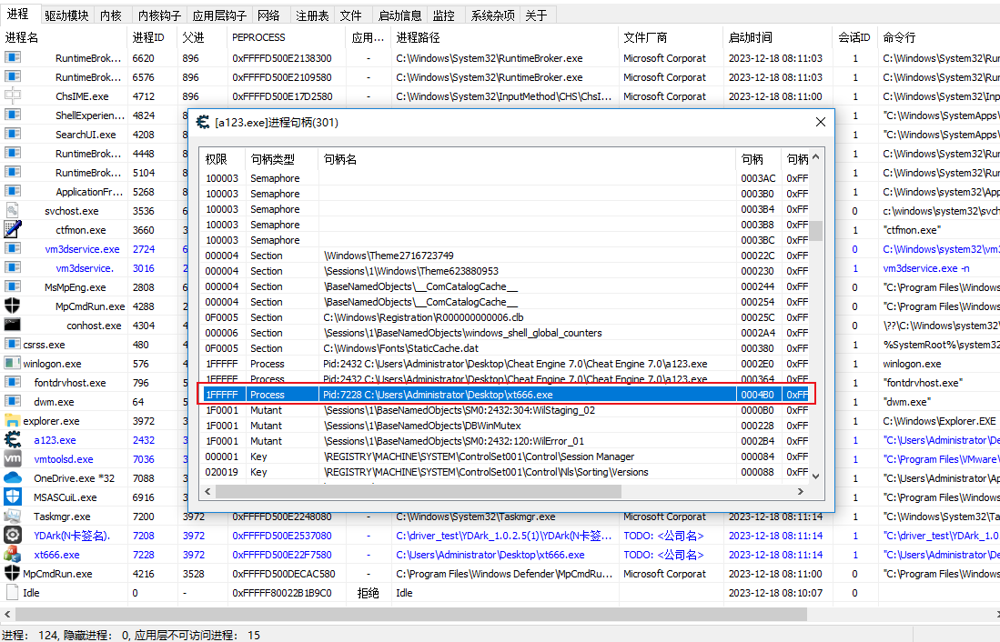

# 一、windbg 验证全局句柄操作
## 1. 使用通配符 模糊查找
~~~sql
X nt!PS*cid*

-- 输出

0: kd> X nt!PS*cid*
fffff802`fa5381a0 nt!PsLookupProcessThreadByCid (void)
fffff802`fa4e2fc0 nt!PspReferenceCidTableEntry (void)
fffff802`fa4d79d4 nt!PspClearProcessThreadCidRefs (void)
fffff802`fa475388 nt!PspCidTable = <no type information>

~~~

## 2.查询 nt!PspCidTable 函数 的数据
~~~dql
dq nt!PspCidTable

<!-- 输出 -->
0: kd> dq nt!PspCidTable
fffff802`fa475388  ffff850f`d0e16c00 fffff802`fa475390
fffff802`fa475398  fffff802`fa475390 ffff9c04`138bd9e0
fffff802`fa4753a8  00000000`00000002 00000000`00000000
fffff802`fa4753b8  00010000`00000000 0000b701`00001000
fffff802`fa4753c8  ffff9c04`13879960 00000000`00000000
fffff802`fa4753d8  00000000`00000000 00000000`00000000
fffff802`fa4753e8  00000000`00000000 00000000`00000000
fffff802`fa4753f8  ffff9c04`139e57c0 00000000`00000000

~~~

## 3.格式化查看 _HANDLE_TABLE 数据 

* dt 命令格式化显示变量的资料和结构 
~~~sql
0: kd> dt _HANDLE_TABLE ffff850f`d0e16c00
ntdll!_HANDLE_TABLE
   +0x000 NextHandleNeedingPool : 0x2000
   +0x004 ExtraInfoPages   : 0n0
   +0x008 TableCode        : 0xffff850f`d29ac001
   +0x010 QuotaProcess     : (null) 
   +0x018 HandleTableList  : _LIST_ENTRY [ 0xffff850f`d0e16c18 - 0xffff850f`d0e16c18 ]
   +0x028 UniqueProcessId  : 0
   +0x02c Flags            : 1
   +0x02c StrictFIFO       : 0y1
   +0x02c EnableHandleExceptions : 0y0
   +0x02c Rundown          : 0y0
   +0x02c Duplicated       : 0y0
   +0x02c RaiseUMExceptionOnInvalidHandleClose : 0y0
   +0x030 HandleContentionEvent : _EX_PUSH_LOCK
   +0x038 HandleTableLock  : _EX_PUSH_LOCK
   +0x040 FreeLists        : [1] _HANDLE_TABLE_FREE_LIST
   +0x040 ActualEntry      : [32]  ""
   +0x060 DebugInfo        : (null) 

~~~
 +0x008 TableCode        : 0xffff850f`d29ac001 

 这里是二级分页表的地址 需要访问尾数为0的地址：0xffff850f`d29ac000

 ~~~sql
 0: kd> dq 0xffff850f`d29ac000
ffff850f`d29ac000  ffff850f`d0e1a000 ffff850f`d29ad000
ffff850f`d29ac010  ffff850f`d2e9c000 ffff850f`d34bd000
ffff850f`d29ac020  ffff850f`d2fde000 ffff850f`d3f88000
ffff850f`d29ac030  ffff850f`d42ff000 ffff850f`d4e60000
ffff850f`d29ac040  00000000`00000000 00000000`00000000
ffff850f`d29ac050  00000000`00000000 00000000`00000000
ffff850f`d29ac060  00000000`00000000 00000000`00000000
ffff850f`d29ac070  00000000`00000000 00000000`00000000

 ~~~
* 这里就获取到分页表的地址

## 4.获取分页表数据 解密进程序号地址数据

* 我们需要查询 pID 为2692 的进程。

* 首先需要确认是这个进程id是在第几张分页内，\
每张分页大小为 0x1000 一张分页中可以存放1024个进程索引\
所以 2692\1024=2 余数为644 （0x284）
* 那么需要寻找的地址为 ffff850f`d2e9c000 + 4*0x284

*dq ffff850f`d2e9c000+4\*0x284
~~~sql
0: kd> dq ffff850f`d2e9c000+4*0x284
ffff850f`d2e9ca10  9c0416eb`4580fcd5 00000000`00000000
ffff850f`d2e9ca20  9c04170e`3700ff33 00000000`00000000
ffff850f`d2e9ca30  9c0415df`9080fff5 00000000`00000000
ffff850f`d2e9ca40  9c0415df`8080fffd 00000000`00000000
ffff850f`d2e9ca50  9c0415df`7080fffd 00000000`00000000
ffff850f`d2e9ca60  9c0415df`6080fffd 00000000`00000000
ffff850f`d2e9ca70  9c0415df`5080fffd 00000000`00000000
ffff850f`d2e9ca80  9c0415df`2080fffd 00000000`00000000
--这里获取到这张表里的进程索引数据（加密的）
~~~

*需要将 9c0416eb\`4580fcd5 右移 16位 补f 那么 得到的地址就是 ffff9c04\`16eb4580

## 5.获取进程的 _EPROCESS 数据
* dt _EPROCESS ffff9c04`16eb4580\
以_EPROCESS 数据格式来查看这个地址的数据
~~~sql
0: kd> dt _EPROCESS ffff9c04`16eb4580
ntdll!_EPROCESS
   +0x000 Pcb              : _KPROCESS
   +0x2d8 ProcessLock      : _EX_PUSH_LOCK
   +0x2e0 UniqueProcessId  : 0x00000000`00000a84 Void
   +0x2e8 ActiveProcessLinks : _LIST_ENTRY [ 0xffff9c04`17307368 - 0xffff9c04`16ec0868 ]
   +0x2f8 RundownProtect   : _EX_RUNDOWN_REF
   +0x300 Flags2           : 0x200d000
   +0x300 JobNotReallyActive : 0y0
   +0x300 AccountingFolded : 0y0
   +0x300 NewProcessReported : 0y0
   +0x300 ExitProcessReported : 0y0
   +0x300 ReportCommitChanges : 0y0
   +0x300 LastReportMemory : 0y0
   +0x300 ForceWakeCharge  : 0y0
   +0x300 CrossSessionCreate : 0y0
   +0x300 NeedsHandleRundown : 0y0
   +0x300 RefTraceEnabled  : 0y0
   +0x300 PicoCreated      : 0y0
   +0x300 EmptyJobEvaluated : 0y0
   +0x300 DefaultPagePriority : 0y101
   +0x300 PrimaryTokenFrozen : 0y1
   +0x300 ProcessVerifierTarget : 0y0
   +0x300 RestrictSetThreadContext : 0y0
   +0x300 AffinityPermanent : 0y0
   +0x300 AffinityUpdateEnable : 0y0
   +0x300 PropagateNode    : 0y0
   +0x300 ExplicitAffinity : 0y0
   +0x300 ProcessExecutionState : 0y00
   +0x300 EnableReadVmLogging : 0y0
   +0x300 EnableWriteVmLogging : 0y1
   +0x300 FatalAccessTerminationRequested : 0y0
   +0x300 DisableSystemAllowedCpuSet : 0y0
   +0x300 ProcessStateChangeRequest : 0y00
   +0x300 ProcessStateChangeInProgress : 0y0
   +0x300 InPrivate        : 0y0
   +0x304 Flags            : 0x144d0c01
   +0x304 CreateReported   : 0y1
   +0x304 NoDebugInherit   : 0y0
   +0x304 ProcessExiting   : 0y0
   +0x304 ProcessDelete    : 0y0
   +0x304 ManageExecutableMemoryWrites : 0y0
   +0x304 VmDeleted        : 0y0
   +0x304 OutswapEnabled   : 0y0
   +0x304 Outswapped       : 0y0
   +0x304 FailFastOnCommitFail : 0y0
   +0x304 Wow64VaSpace4Gb  : 0y0
   +0x304 AddressSpaceInitialized : 0y11
   +0x304 SetTimerResolution : 0y0
   +0x304 BreakOnTermination : 0y0
   +0x304 DeprioritizeViews : 0y0
   +0x304 WriteWatch       : 0y0
   +0x304 ProcessInSession : 0y1
   +0x304 OverrideAddressSpace : 0y0
   +0x304 HasAddressSpace  : 0y1
   +0x304 LaunchPrefetched : 0y1
   +0x304 Background       : 0y0
   +0x304 VmTopDown        : 0y0
   +0x304 ImageNotifyDone  : 0y1
   +0x304 PdeUpdateNeeded  : 0y0
   +0x304 VdmAllowed       : 0y0
   +0x304 ProcessRundown   : 0y0
   +0x304 ProcessInserted  : 0y1
   +0x304 DefaultIoPriority : 0y010
   +0x304 ProcessSelfDelete : 0y0
   +0x304 SetTimerResolutionLink : 0y0
   +0x308 CreateTime       : _LARGE_INTEGER 0x01da30ec`0d56791b
   +0x310 ProcessQuotaUsage : [2] 0x2e30
   +0x320 ProcessQuotaPeak : [2] 0x2fc8
   +0x330 PeakVirtualSize  : 0x00000001`0aeab000
   +0x338 VirtualSize      : 0x00000001`0a6ba000
   +0x340 SessionProcessLinks : _LIST_ENTRY [ 0xffff9c04`16a3c8c0 - 0xffff9c04`16ec08c0 ]
   +0x350 ExceptionPortData : 0xffff9c04`1581ee20 Void
   +0x350 ExceptionPortValue : 0xffff9c04`1581ee20
   +0x350 ExceptionPortState : 0y000
   +0x358 Token            : _EX_FAST_REF
   +0x360 MmReserved       : 0
   +0x368 AddressCreationLock : _EX_PUSH_LOCK
   +0x370 PageTableCommitmentLock : _EX_PUSH_LOCK
   +0x378 RotateInProgress : (null) 
   +0x380 ForkInProgress   : (null) 
   +0x388 CommitChargeJob  : (null) 
   +0x390 CloneRoot        : _RTL_AVL_TREE
   +0x398 NumberOfPrivatePages : 0x1de
   +0x3a0 NumberOfLockedPages : 0
   +0x3a8 Win32Process     : 0xffff96d3`c4e0c5b0 Void
   +0x3b0 Job              : (null) 
   +0x3b8 SectionObject    : 0xffff850f`d479dd50 Void
   +0x3c0 SectionBaseAddress : 0x00007ff6`01af0000 Void
   +0x3c8 Cookie           : 0x2bf9ae7a
   +0x3d0 WorkingSetWatch  : (null) 
   +0x3d8 Win32WindowStation : 0x00000000`0000008c Void
   +0x3e0 InheritedFromUniqueProcessId : 0x00000000`00000fe0 Void
   +0x3e8 LdtInformation   : (null) 
   +0x3f0 OwnerProcessId   : 0xfe2
   +0x3f8 Peb              : 0x000000b0`0fa5e000 _PEB
   +0x400 Session          : 0xffffc901`623f8000 _MM_SESSION_SPACE
   +0x408 AweInfo          : (null) 
   +0x410 QuotaBlock       : 0xffff9c04`15971d80 _EPROCESS_QUOTA_BLOCK
   +0x418 ObjectTable      : 0xffff850f`d49cec00 _HANDLE_TABLE
   +0x420 DebugPort        : (null) 
   +0x428 WoW64Process     : (null) 
   +0x430 DeviceMap        : 0xffff850f`d2f9f6f0 Void
   +0x438 EtwDataSource    : 0xffff9c04`16dda240 Void
   +0x440 PageDirectoryPte : 0
   +0x448 ImageFilePointer : 0xffff9c04`16b82d80 _FILE_OBJECT
   +0x450 ImageFileName    : [15]  "MFCApplication"
   +0x45f PriorityClass    : 0x2 ''
   +0x460 SecurityPort     : (null) 
   +0x468 SeAuditProcessCreationInfo : _SE_AUDIT_PROCESS_CREATION_INFO
   +0x470 JobLinks         : _LIST_ENTRY [ 0x00000000`00000000 - 0x00000000`00000000 ]
   +0x480 HighestUserAddress : 0x00007fff`ffff0000 Void
   +0x488 ThreadListHead   : _LIST_ENTRY [ 0xffff9c04`172cb728 - 0xffff9c04`172cb728 ]
   +0x498 ActiveThreads    : 1
   +0x49c ImagePathHash    : 0xcb6d7388
   +0x4a0 DefaultHardErrorProcessing : 0x8000
   +0x4a4 LastThreadExitStatus : 0n0
   +0x4a8 PrefetchTrace    : _EX_FAST_REF
   +0x4b0 LockedPagesList  : (null) 
   +0x4b8 ReadOperationCount : _LARGE_INTEGER 0x0
   +0x4c0 WriteOperationCount : _LARGE_INTEGER 0x0
   +0x4c8 OtherOperationCount : _LARGE_INTEGER 0x9
   +0x4d0 ReadTransferCount : _LARGE_INTEGER 0x0
   +0x4d8 WriteTransferCount : _LARGE_INTEGER 0x0
   +0x4e0 OtherTransferCount : _LARGE_INTEGER 0x0
   +0x4e8 CommitChargeLimit : 0
   +0x4f0 CommitCharge     : 0x659
   +0x4f8 CommitChargePeak : 0x66c
   +0x500 Vm               : _MMSUPPORT_FULL
   +0x610 MmProcessLinks   : _LIST_ENTRY [ 0xffff9c04`17307690 - 0xffff9c04`16ec0b90 ]
   +0x620 ModifiedPageCount : 0xb
   +0x624 ExitStatus       : 0n259
   +0x628 VadRoot          : _RTL_AVL_TREE
   +0x630 VadHint          : 0xffff9c04`16fa4520 Void
   +0x638 VadCount         : 0x55
   +0x640 VadPhysicalPages : 0
   +0x648 VadPhysicalPagesLimit : 0
   +0x650 AlpcContext      : _ALPC_PROCESS_CONTEXT
   +0x670 TimerResolutionLink : _LIST_ENTRY [ 0x00000000`00000000 - 0x00000000`00000000 ]
   +0x680 TimerResolutionStackRecord : (null) 
   +0x688 RequestedTimerResolution : 0
   +0x68c SmallestTimerResolution : 0
   +0x690 ExitTime         : _LARGE_INTEGER 0x0
   +0x698 InvertedFunctionTable : (null) 
   +0x6a0 InvertedFunctionTableLock : _EX_PUSH_LOCK
   +0x6a8 ActiveThreadsHighWatermark : 4
   +0x6ac LargePrivateVadCount : 0
   +0x6b0 ThreadListLock   : _EX_PUSH_LOCK
   +0x6b8 WnfContext       : 0xffff850f`d4c0eed0 Void
   +0x6c0 ServerSilo       : (null) 
   +0x6c8 SignatureLevel   : 0 ''
   +0x6c9 SectionSignatureLevel : 0 ''
   +0x6ca Protection       : _PS_PROTECTION
   +0x6cb HangCount        : 0y0000
   +0x6cb GhostCount       : 0y0000
   +0x6cc Flags3           : 0x8000
   +0x6cc Minimal          : 0y0
   +0x6cc ReplacingPageRoot : 0y0
   +0x6cc Crashed          : 0y0
   +0x6cc JobVadsAreTracked : 0y0
   +0x6cc VadTrackingDisabled : 0y0
   +0x6cc AuxiliaryProcess : 0y0
   +0x6cc SubsystemProcess : 0y0
   +0x6cc IndirectCpuSets  : 0y0
   +0x6cc RelinquishedCommit : 0y0
   +0x6cc HighGraphicsPriority : 0y0
   +0x6cc CommitFailLogged : 0y0
   +0x6cc ReserveFailLogged : 0y0
   +0x6cc SystemProcess    : 0y0
   +0x6cc HideImageBaseAddresses : 0y0
   +0x6cc AddressPolicyFrozen : 0y0
   +0x6cc ProcessFirstResume : 0y1
   +0x6cc ForegroundExternal : 0y0
   +0x6cc ForegroundSystem : 0y0
   +0x6cc HighMemoryPriority : 0y0
   +0x6d0 DeviceAsid       : 0n0
   +0x6d8 SvmData          : (null) 
   +0x6e0 SvmProcessLock   : _EX_PUSH_LOCK
   +0x6e8 SvmLock          : 0
   +0x6f0 SvmProcessDeviceListHead : _LIST_ENTRY [ 0xffff9c04`16eb4c70 - 0xffff9c04`16eb4c70 ]
   +0x700 LastFreezeInterruptTime : 0
   +0x708 DiskCounters     : 0xffff9c04`16eb4dc8 _PROCESS_DISK_COUNTERS
   +0x710 PicoContext      : (null) 
   +0x718 TrustletIdentity : 0
   +0x720 EnclaveTable     : (null) 
   +0x728 EnclaveNumber    : 0
   +0x730 EnclaveLock      : _EX_PUSH_LOCK
   +0x738 HighPriorityFaultsAllowed : 0
   +0x740 EnergyContext    : 0xffff9c04`16eb4df0 _PO_PROCESS_ENERGY_CONTEXT
   +0x748 VmContext        : (null) 
   +0x750 SequenceNumber   : 0x86
   +0x758 CreateInterruptTime : 0x2daca65c
   +0x760 CreateUnbiasedInterruptTime : 0x2daca65c
   +0x768 TotalUnbiasedFrozenTime : 0
   +0x770 LastAppStateUpdateTime : 0x2daca65c
   +0x778 LastAppStateUptime : 0y0000000000000000000000000000000000000000000000000000000000000 (0)
   +0x778 LastAppState     : 0y000
   +0x780 SharedCommitCharge : 0x3d6
   +0x788 SharedCommitLock : _EX_PUSH_LOCK
   +0x790 SharedCommitLinks : _LIST_ENTRY [ 0xffff850f`d4b1b4c8 - 0xffff850f`d2fccbd8 ]
   +0x7a0 AllowedCpuSets   : 0
   +0x7a8 DefaultCpuSets   : 0
   +0x7a0 AllowedCpuSetsIndirect : (null) 
   +0x7a8 DefaultCpuSetsIndirect : (null) 
   +0x7b0 DiskIoAttribution : (null) 
   +0x7b8 DxgProcess       : 0xffff850f`d43ce3f0 Void
   +0x7c0 Win32KFilterSet  : 0
   +0x7c8 ProcessTimerDelay : _PS_INTERLOCKED_TIMER_DELAY_VALUES
   +0x7d0 KTimerSets       : 0
   +0x7d4 KTimer2Sets      : 0
   +0x7d8 ThreadTimerSets  : 1
   +0x7e0 VirtualTimerListLock : 0
   +0x7e8 VirtualTimerListHead : _LIST_ENTRY [ 0xffff9c04`16eb4d68 - 0xffff9c04`16eb4d68 ]
   +0x7f8 WakeChannel      : _WNF_STATE_NAME
   +0x7f8 WakeInfo         : _PS_PROCESS_WAKE_INFORMATION
   +0x828 MitigationFlags  : 0x20
   +0x828 MitigationFlagsValues : <unnamed-tag>
   +0x82c MitigationFlags2 : 0
   +0x82c MitigationFlags2Values : <unnamed-tag>
   +0x830 PartitionObject  : 0xffff9c04`138c39a0 Void
   +0x838 SecurityDomain   : 0x00000001`0000004d
   +0x840 CoverageSamplerContext : (null) 

~~~
* +0x2e0 UniqueProcessId  : 0x00000000`00000a84 Void\
这里就是进程的pid 0xA84 就是 2692

* +0x450 ImageFileName    : [15]  "MFCApplication"\
 ImageFileName 就是进程的名称

# 二、windbg 查找私有句柄

## 1.使用windbg 附加进程
- 命令 !process 0 0 a123.exe
~~~sql 

0: kd> !process 0 0 a123.exe
PROCESS ffffd500e19dc580
    SessionId: 1  Cid: 0980    Peb: 002f1000  ParentCid: 0f84
    DirBase: 3e400000  ObjectTable: ffffbf8bbaddd840  HandleCount: 301.
    Image: a123.exe

~~~

## 2. ObjectTable 中 找到TableCode
- 命令： dt _HANDLE_TABLE ffffbf8bbaddd840
~~~sql
0: kd> dt _HANDLE_TABLE ffffbf8bbaddd840
ntdll!_HANDLE_TABLE
   +0x000 NextHandleNeedingPool : 0x800
   +0x004 ExtraInfoPages   : 0n0
   +0x008 TableCode        : 0xffffbf8b`bbafc001
   +0x010 QuotaProcess     : 0xffffd500`e19dc580 _EPROCESS
   +0x018 HandleTableList  : _LIST_ENTRY [ 0xffffbf8b`b9e88858 - 0xffffbf8b`bab54618 ]
   +0x028 UniqueProcessId  : 0x980
   +0x02c Flags            : 0
   +0x02c StrictFIFO       : 0y0
   +0x02c EnableHandleExceptions : 0y0
   +0x02c Rundown          : 0y0
   +0x02c Duplicated       : 0y0
   +0x02c RaiseUMExceptionOnInvalidHandleClose : 0y0
   +0x030 HandleContentionEvent : _EX_PUSH_LOCK
   +0x038 HandleTableLock  : _EX_PUSH_LOCK
   +0x040 FreeLists        : [1] _HANDLE_TABLE_FREE_LIST
   +0x040 ActualEntry      : [32]  ""
   +0x060 DebugInfo        : (null) 

~~~
## 3. 查看句柄分页

- 句柄为 0x4b0 在第二页的 序号为B0 的位置
- 命令： dq 0xffffbf8b`bbafc000
~~~sql
0: kd> DQ 0xffffbf8b`bbafc000
ffffbf8b`bbafc000  ffffbf8b`bb8af000 ffffbf8b`bbb06000
ffffbf8b`bbafc010  00000000`00000000 00000000`00000000
ffffbf8b`bbafc020  00000000`00000000 00000000`00000000
ffffbf8b`bbafc030  00000000`00000000 00000000`00000000
ffffbf8b`bbafc040  00000000`00000000 00000000`00000000
ffffbf8b`bbafc050  00000000`00000000 00000000`00000000
ffffbf8b`bbafc060  00000000`00000000 00000000`00000000
ffffbf8b`bbafc070  00000000`00000000 00000000`00000000

~~~
- 命令: DQ ffffbf8b`bbb06000+4*B0
~~~sql
0: kd> DQ ffffbf8b`bbb06000+4*B0
ffffbf8b`bbb062c0  d500e22f`7550de51 00000000`001fffff
ffffbf8b`bbb062d0  d500e1ee`ee30fffd 00000000`001f0003
ffffbf8b`bbb062e0  d500e261`f042fff9 00000000`001f0001
ffffbf8b`bbb062f0  00000000`00000000 ffffbf8b`bbb06160
ffffbf8b`bbb06300  00000000`00000000 ffffbf8b`bbb062f0
ffffbf8b`bbb06310  d500e1e7`1610fffd 00000000`001fffff
ffffbf8b`bbb06320  00000000`00000000 ffffbf8b`bbb06300
ffffbf8b`bbb06330  00000000`00000000 ffffbf8b`bbb06320

~~~
- 也可以直接用 dt_HANDLE_TABLE_ENTRY + 数据的地址  命令获取解密后的地址
- 命令 dt _HANDLE_TABLE_ENTRY ffffbf8b`bbb062c0
~~~sql 
0: kd> dt _HANDLE_TABLE_ENTRY ffffbf8b`bbb062c0
ntdll!_HANDLE_TABLE_ENTRY
   +0x000 VolatileLowValue : 0n-3098227850171326895
   +0x000 LowValue         : 0n-3098227850171326895
   +0x000 InfoTable        : 0xd500e22f`7550de51 _HANDLE_TABLE_ENTRY_INFO
   +0x008 HighValue        : 0n2097151
   +0x008 NextFreeHandleEntry : 0x00000000`001fffff _HANDLE_TABLE_ENTRY
   +0x008 LeafHandleValue  : _EXHANDLE
   +0x000 RefCountField    : 0n-3098227850171326895
   +0x000 Unlocked         : 0y1
   +0x000 RefCnt           : 0y0110111100101000 (0x6f28)
   +0x000 Attributes       : 0y000
   +0x000 ObjectPointerBits : 0y11010101000000001110001000101111011101010101 (0xd500e22f755)
   +0x008 GrantedAccessBits : 0y0000111111111111111111111 (0x1fffff)
   +0x008 NoRightsUpgrade  : 0y0
   +0x008 Spare1           : 0y000000 (0)
   +0x00c Spare2           : 0

--这里的  +0x000 ObjectPointerBits : 0y11010101000000001110001000101111011101010101 (0xd500e22f755) 前面加ffff ，后面补一位0，就得到了地址 0xffffd500e22f7550

~~~
## 4. 查看 _OBJECT_HEADER 和 _EPROCESS 结构数据
- 私有句柄结构 和 全局句柄结构不同 在前面有一个 +0x30 长度的 _OBJECT_HEADER 数据
- 查看 _OBJECT_HEADER 
- 命令 ： dt _OBJECT_HEADER ffffd500`e22f7550
~~~sql
0: kd> dt _OBJECT_HEADER ffffd500`e22f7550
nt!_OBJECT_HEADER
   +0x000 PointerCount     : 0n257620
   +0x008 HandleCount      : 0n7
   +0x008 NextToFree       : 0x00000000`00000007 Void
   +0x010 Lock             : _EX_PUSH_LOCK
   +0x018 TypeIndex        : 0xae ''
   +0x019 TraceFlags       : 0 ''
   +0x019 DbgRefTrace      : 0y0
   +0x019 DbgTracePermanent : 0y0
   +0x01a InfoMask         : 0x8 ''
   +0x01b Flags            : 0 ''
   +0x01b NewObject        : 0y0
   +0x01b KernelObject     : 0y0
   +0x01b KernelOnlyAccess : 0y0
   +0x01b ExclusiveObject  : 0y0
   +0x01b PermanentObject  : 0y0
   +0x01b DefaultSecurityQuota : 0y0
   +0x01b SingleHandleEntry : 0y0
   +0x01b DeletedInline    : 0y0
   +0x01c Reserved         : 0
   +0x020 ObjectCreateInfo : 0xffffd500`deb2abc0 _OBJECT_CREATE_INFORMATION
   +0x020 QuotaBlockCharged : 0xffffd500`deb2abc0 Void
   +0x028 SecurityDescriptor : 0xffffbf8b`b923f068 Void
   +0x030 Body             : _QUAD

~~~

- 查看_EOROCESS 结构数据
- 命令： dt _EPROCESS ffffd500`e22f7550+0x30
~~~sql
0: kd> dt _EPROCESS ffffd500`e22f7550+0x30
ntdll!_EPROCESS
   +0x000 Pcb              : _KPROCESS
   +0x2d8 ProcessLock      : _EX_PUSH_LOCK
   +0x2e0 UniqueProcessId  : 0x00000000`00001c3c Void
   +0x2e8 ActiveProcessLinks : _LIST_ENTRY [ 0xffffd500`e2468868 - 0xffffd500`e2537368 ]
   +0x2f8 RundownProtect   : _EX_RUNDOWN_REF
   +0x300 Flags2           : 0x200d000
   +0x300 JobNotReallyActive : 0y0
   +0x300 AccountingFolded : 0y0
   +0x300 NewProcessReported : 0y0
   +0x300 ExitProcessReported : 0y0
   +0x300 ReportCommitChanges : 0y0
   +0x300 LastReportMemory : 0y0
   +0x300 ForceWakeCharge  : 0y0
   +0x300 CrossSessionCreate : 0y0
   +0x300 NeedsHandleRundown : 0y0
   +0x300 RefTraceEnabled  : 0y0
   +0x300 PicoCreated      : 0y0
   +0x300 EmptyJobEvaluated : 0y0
   +0x300 DefaultPagePriority : 0y101
   +0x300 PrimaryTokenFrozen : 0y1
   +0x300 ProcessVerifierTarget : 0y0
   +0x300 RestrictSetThreadContext : 0y0
   +0x300 AffinityPermanent : 0y0
   +0x300 AffinityUpdateEnable : 0y0
   +0x300 PropagateNode    : 0y0
   +0x300 ExplicitAffinity : 0y0
   +0x300 ProcessExecutionState : 0y00
   +0x300 EnableReadVmLogging : 0y0
   +0x300 EnableWriteVmLogging : 0y1
   +0x300 FatalAccessTerminationRequested : 0y0
   +0x300 DisableSystemAllowedCpuSet : 0y0
   +0x300 ProcessStateChangeRequest : 0y00
   +0x300 ProcessStateChangeInProgress : 0y0
   +0x300 InPrivate        : 0y0
   +0x304 Flags            : 0x144d0c01
   +0x304 CreateReported   : 0y1
   +0x304 NoDebugInherit   : 0y0
   +0x304 ProcessExiting   : 0y0
   +0x304 ProcessDelete    : 0y0
   +0x304 ManageExecutableMemoryWrites : 0y0
   +0x304 VmDeleted        : 0y0
   +0x304 OutswapEnabled   : 0y0
   +0x304 Outswapped       : 0y0
   +0x304 FailFastOnCommitFail : 0y0
   +0x304 Wow64VaSpace4Gb  : 0y0
   +0x304 AddressSpaceInitialized : 0y11
   +0x304 SetTimerResolution : 0y0
   +0x304 BreakOnTermination : 0y0
   +0x304 DeprioritizeViews : 0y0
   +0x304 WriteWatch       : 0y0
   +0x304 ProcessInSession : 0y1
   +0x304 OverrideAddressSpace : 0y0
   +0x304 HasAddressSpace  : 0y1
   +0x304 LaunchPrefetched : 0y1
   +0x304 Background       : 0y0
   +0x304 VmTopDown        : 0y0
   +0x304 ImageNotifyDone  : 0y1
   +0x304 PdeUpdateNeeded  : 0y0
   +0x304 VdmAllowed       : 0y0
   +0x304 ProcessRundown   : 0y0
   +0x304 ProcessInserted  : 0y1
   +0x304 DefaultIoPriority : 0y010
   +0x304 ProcessSelfDelete : 0y0
   +0x304 SetTimerResolutionLink : 0y0
   +0x308 CreateTime       : _LARGE_INTEGER 0x01da3146`b6bc6d74
   +0x310 ProcessQuotaUsage : [2] 0x2e30
   +0x320 ProcessQuotaPeak : [2] 0x3048
   +0x330 PeakVirtualSize  : 0x00000001`0aeab000
   +0x338 VirtualSize      : 0x00000001`0a7b9000
   +0x340 SessionProcessLinks : _LIST_ENTRY [ 0xffffd500`e19dc8c0 - 0xffffd500`e25373c0 ]
   +0x350 ExceptionPortData : 0xffffd500`e07ed090 Void
   +0x350 ExceptionPortValue : 0xffffd500`e07ed090
   +0x350 ExceptionPortState : 0y000
   +0x358 Token            : _EX_FAST_REF
   +0x360 MmReserved       : 0
   +0x368 AddressCreationLock : _EX_PUSH_LOCK
   +0x370 PageTableCommitmentLock : _EX_PUSH_LOCK
   +0x378 RotateInProgress : (null) 
   +0x380 ForkInProgress   : (null) 
   +0x388 CommitChargeJob  : (null) 
   +0x390 CloneRoot        : _RTL_AVL_TREE
   +0x398 NumberOfPrivatePages : 0x1d8
   +0x3a0 NumberOfLockedPages : 0
   +0x3a8 Win32Process     : 0xfffff442`84e0f010 Void
   +0x3b0 Job              : (null) 
   +0x3b8 SectionObject    : 0xffffbf8b`bab4dfc0 Void
   +0x3c0 SectionBaseAddress : 0x00007ff7`c7580000 Void
   +0x3c8 Cookie           : 0xb7740811
   +0x3d0 WorkingSetWatch  : (null) 
   +0x3d8 Win32WindowStation : 0x00000000`0000008c Void
   +0x3e0 InheritedFromUniqueProcessId : 0x00000000`00000f84 Void
   +0x3e8 LdtInformation   : (null) 
   +0x3f0 OwnerProcessId   : 0xf86
   +0x3f8 Peb              : 0x0000002d`48262000 _PEB
   +0x400 Session          : 0xffff8501`92934000 _MM_SESSION_SPACE
   +0x408 AweInfo          : (null) 
   +0x410 QuotaBlock       : 0xffffd500`deb2abc0 _EPROCESS_QUOTA_BLOCK
   +0x418 ObjectTable      : 0xffffbf8b`bac88480 _HANDLE_TABLE
   +0x420 DebugPort        : (null) 
   +0x428 WoW64Process     : (null) 
   +0x430 DeviceMap        : 0xffffbf8b`b91d93f0 Void
   +0x438 EtwDataSource    : 0xffffd500`e25ea7b0 Void
   +0x440 PageDirectoryPte : 0
   +0x448 ImageFilePointer : 0xffffd500`e2325510 _FILE_OBJECT
   +0x450 ImageFileName    : [15]  "xt666.exe"
   +0x45f PriorityClass    : 0x2 ''
   +0x460 SecurityPort     : (null) 
   +0x468 SeAuditProcessCreationInfo : _SE_AUDIT_PROCESS_CREATION_INFO
   +0x470 JobLinks         : _LIST_ENTRY [ 0x00000000`00000000 - 0x00000000`00000000 ]
   +0x480 HighestUserAddress : 0x00007fff`ffff0000 Void
   +0x488 ThreadListHead   : _LIST_ENTRY [ 0xffffd500`e2316da8 - 0xffffd500`e225e6e8 ]
   +0x498 ActiveThreads    : 2
   +0x49c ImagePathHash    : 0xc1160cc7
   +0x4a0 DefaultHardErrorProcessing : 0x8000
   +0x4a4 LastThreadExitStatus : 0n0
   +0x4a8 PrefetchTrace    : _EX_FAST_REF
   +0x4b0 LockedPagesList  : (null) 
   +0x4b8 ReadOperationCount : _LARGE_INTEGER 0x0
   +0x4c0 WriteOperationCount : _LARGE_INTEGER 0x0
   +0x4c8 OtherOperationCount : _LARGE_INTEGER 0xb
   +0x4d0 ReadTransferCount : _LARGE_INTEGER 0x0
   +0x4d8 WriteTransferCount : _LARGE_INTEGER 0x0
   +0x4e0 OtherTransferCount : _LARGE_INTEGER 0x0
   +0x4e8 CommitChargeLimit : 0
   +0x4f0 CommitCharge     : 0x65f
   +0x4f8 CommitChargePeak : 0x66d
   +0x500 Vm               : _MMSUPPORT_FULL
   +0x610 MmProcessLinks   : _LIST_ENTRY [ 0xffffd500`e2468b90 - 0xffffd500`e2537690 ]
   +0x620 ModifiedPageCount : 5
   +0x624 ExitStatus       : 0n259
   +0x628 VadRoot          : _RTL_AVL_TREE
   +0x630 VadHint          : 0xffffd500`e2316250 Void
   +0x638 VadCount         : 0x55
   +0x640 VadPhysicalPages : 0
   +0x648 VadPhysicalPagesLimit : 0
   +0x650 AlpcContext      : _ALPC_PROCESS_CONTEXT
   +0x670 TimerResolutionLink : _LIST_ENTRY [ 0x00000000`00000000 - 0x00000000`00000000 ]
   +0x680 TimerResolutionStackRecord : (null) 
   +0x688 RequestedTimerResolution : 0
   +0x68c SmallestTimerResolution : 0
   +0x690 ExitTime         : _LARGE_INTEGER 0x0
   +0x698 InvertedFunctionTable : (null) 
   +0x6a0 InvertedFunctionTableLock : _EX_PUSH_LOCK
   +0x6a8 ActiveThreadsHighWatermark : 4
   +0x6ac LargePrivateVadCount : 0
   +0x6b0 ThreadListLock   : _EX_PUSH_LOCK
   +0x6b8 WnfContext       : 0xffffbf8b`bab628b0 Void
   +0x6c0 ServerSilo       : (null) 
   +0x6c8 SignatureLevel   : 0 ''
   +0x6c9 SectionSignatureLevel : 0 ''
   +0x6ca Protection       : _PS_PROTECTION
   +0x6cb HangCount        : 0y0000
   +0x6cb GhostCount       : 0y0000
   +0x6cc Flags3           : 0x8000
   +0x6cc Minimal          : 0y0
   +0x6cc ReplacingPageRoot : 0y0
   +0x6cc Crashed          : 0y0
   +0x6cc JobVadsAreTracked : 0y0
   +0x6cc VadTrackingDisabled : 0y0
   +0x6cc AuxiliaryProcess : 0y0
   +0x6cc SubsystemProcess : 0y0
   +0x6cc IndirectCpuSets  : 0y0
   +0x6cc RelinquishedCommit : 0y0
   +0x6cc HighGraphicsPriority : 0y0
   +0x6cc CommitFailLogged : 0y0
   +0x6cc ReserveFailLogged : 0y0
   +0x6cc SystemProcess    : 0y0
   +0x6cc HideImageBaseAddresses : 0y0
   +0x6cc AddressPolicyFrozen : 0y0
   +0x6cc ProcessFirstResume : 0y1
   +0x6cc ForegroundExternal : 0y0
   +0x6cc ForegroundSystem : 0y0
   +0x6cc HighMemoryPriority : 0y0
   +0x6d0 DeviceAsid       : 0n0
   +0x6d8 SvmData          : (null) 
   +0x6e0 SvmProcessLock   : _EX_PUSH_LOCK
   +0x6e8 SvmLock          : 0
   +0x6f0 SvmProcessDeviceListHead : _LIST_ENTRY [ 0xffffd500`e22f7c70 - 0xffffd500`e22f7c70 ]
   +0x700 LastFreezeInterruptTime : 0
   +0x708 DiskCounters     : 0xffffd500`e22f7dc8 _PROCESS_DISK_COUNTERS
   +0x710 PicoContext      : (null) 
   +0x718 TrustletIdentity : 0
   +0x720 EnclaveTable     : (null) 
   +0x728 EnclaveNumber    : 0
   +0x730 EnclaveLock      : _EX_PUSH_LOCK
   +0x738 HighPriorityFaultsAllowed : 0
   +0x740 EnergyContext    : 0xffffd500`e22f7df0 _PO_PROCESS_ENERGY_CONTEXT
   +0x748 VmContext        : (null) 
   +0x750 SequenceNumber   : 0x8a
   +0x758 CreateInterruptTime : 0x2e4ac248
   +0x760 CreateUnbiasedInterruptTime : 0x2e4ac248
   +0x768 TotalUnbiasedFrozenTime : 0
   +0x770 LastAppStateUpdateTime : 0x2e4ac248
   +0x778 LastAppStateUptime : 0y0000000000000000000000000000000000000000000000000000000000000 (0)
   +0x778 LastAppState     : 0y000
   +0x780 SharedCommitCharge : 0x3fc
   +0x788 SharedCommitLock : _EX_PUSH_LOCK
   +0x790 SharedCommitLinks : _LIST_ENTRY [ 0xffffbf8b`bb082fe8 - 0xffffbf8b`ba869908 ]
   +0x7a0 AllowedCpuSets   : 0
   +0x7a8 DefaultCpuSets   : 0
   +0x7a0 AllowedCpuSetsIndirect : (null) 
   +0x7a8 DefaultCpuSetsIndirect : (null) 
   +0x7b0 DiskIoAttribution : (null) 
   +0x7b8 DxgProcess       : 0xffffbf8b`ba46ae30 Void
   +0x7c0 Win32KFilterSet  : 0
   +0x7c8 ProcessTimerDelay : _PS_INTERLOCKED_TIMER_DELAY_VALUES
   +0x7d0 KTimerSets       : 0
   +0x7d4 KTimer2Sets      : 0
   +0x7d8 ThreadTimerSets  : 7
   +0x7e0 VirtualTimerListLock : 0
   +0x7e8 VirtualTimerListHead : _LIST_ENTRY [ 0xffffd500`e22f7d68 - 0xffffd500`e22f7d68 ]
   +0x7f8 WakeChannel      : _WNF_STATE_NAME
   +0x7f8 WakeInfo         : _PS_PROCESS_WAKE_INFORMATION
   +0x828 MitigationFlags  : 0x20
   +0x828 MitigationFlagsValues : <unnamed-tag>
   +0x82c MitigationFlags2 : 0
   +0x82c MitigationFlags2Values : <unnamed-tag>
   +0x830 PartitionObject  : 0xffffd500`deac39a0 Void
   +0x838 SecurityDomain   : 0x00000001`0000004d
   +0x840 CoverageSamplerContext : (null) 

-- 我们看到 这个句柄的   +0x450 ImageFileName    : [15]  "xt666.exe"
-- 就是ce打开的进程名称
~~~

 